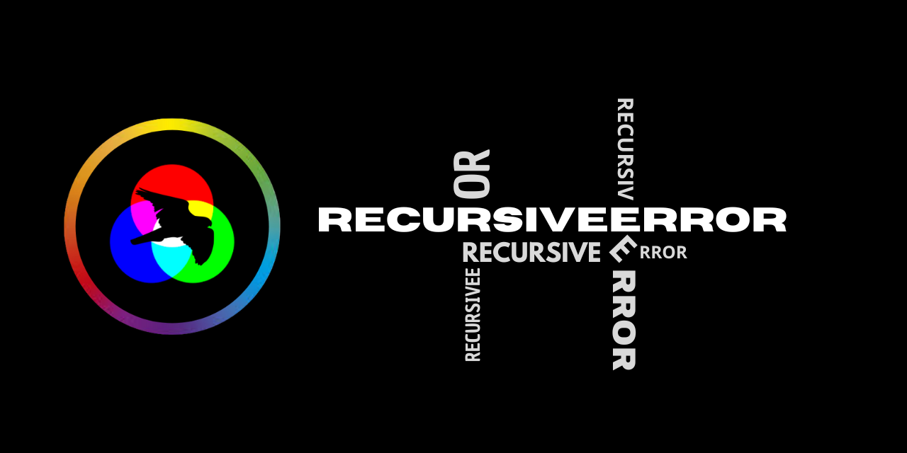

 

  

###

  
  

###

<h1 align="center">hey there 👋</h1>

###

<h3 align="left">👩‍💻  About Me</h3>

###

Desenvolvedor de sistemas embarcados.  Entusiasta de eletrônica e hardware hacking.  Gosto de escrever nas horas vagas.  Atualmente estudo C e FreeRTOS, tenho interesse em C++ moderno, Rust e Zig.

###

<h3 align="left">🛠 Language and tools</h3>

###

  
  
  
  
  
  
  
  
  
  
  

###

<h3 align="left">🔥   My Stats :</h3>

###

  
  

###

###
